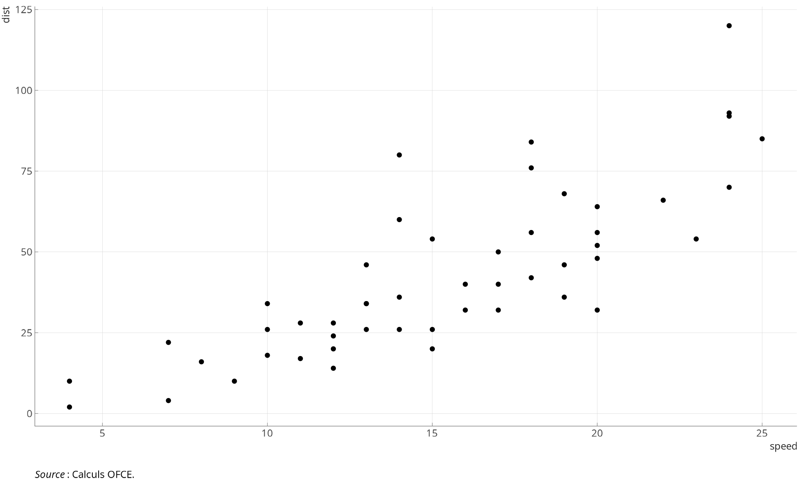

# introduction

## Slide de contenu 1.1

   <!--# pour insérer des lignes -->

### remarque

Une table des matières ainsi qu'un rappel du plan sur les slides de niveau 1 est automatiquement inclus.

C'est pourquoi il ne faut pas mettre de contenu sur les slides de niveau 1

### niveaux

Les niveaux 3 et au délà sont des intertitres sur une slide

pour le dépôt voir 

## Slide de contenu 1.2

::: {.cell}
::: {.cell-output-display}
{#fig-cars fig-pos='htb' width=100%}
:::
:::

# intertitre

## Slide 2.1

Lorem ipsum dolor sit amet, consectetur adipiscing elit, sed do eiusmod tempor incididunt ut labore et dolore magna aliqua. Dolor morbi non arcu risus quis varius quam quisque.

## Slide 2.2

Faucibus turpis in eu mi bibendum. Etiam tempor orci eu lobortis. Sit amet consectetur adipiscing elit pellentesque habitant. Quam viverra orci sagittis eu volutpat odio facilisis mauris sit.

# Conclusions

## Conclusion 1
::: panel-tabset

### 2030 {.tabset}

pbbjoi;afjo

### 2050 {.tabset}

lkwjf;lsjva

:::
Ultrices neque ornare aenean euismod elementum nisi quis eleifend. Vivamus arcu felis bibendum ut tristique. Non nisi est sit amet facilisis magna. Consectetur libero id faucibus nisl tincidunt eget. [@efron1993i]

## Références

::: {#refs}
:::

